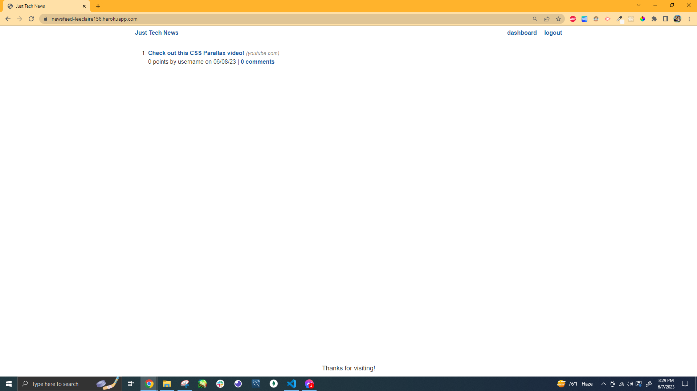
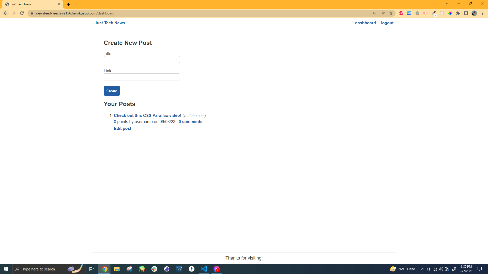
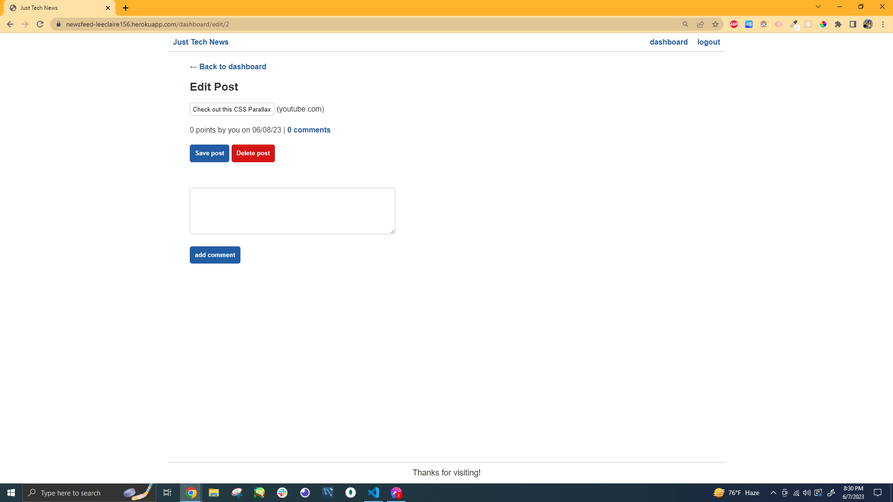
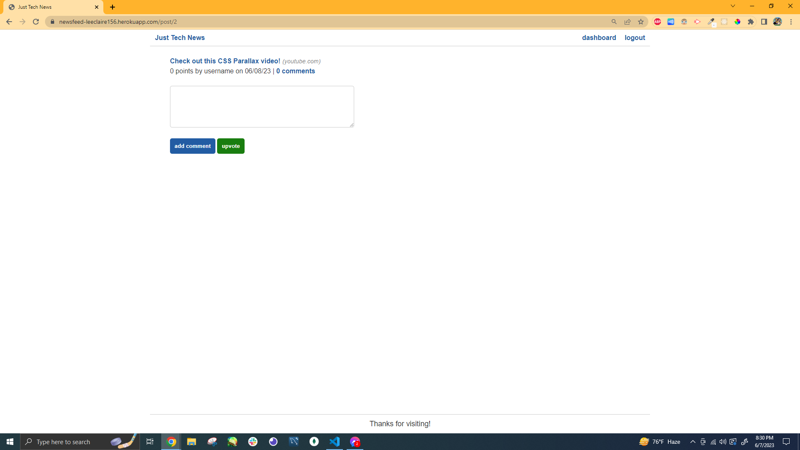

# Just Tech News

## Description
This project is a blog site where users can share their favorite links with other users. Creating a posts requires just a title and the link they want to share. The post title, when clicked on, opens up to the provided link. Users can edit and delete their posts. On other posts, users can also provide comments and upvote.

This project was made with python version 3.11.4, Flask, MySQL Workbench, Visual Studio Code, Git Bash, bcrypt, SQLAlchemy and other dependencies which can be found in requirements.txt

## Table of Contents
- [Installation](#installation-for-further-development-only)
    - [Git/GitBash](#gitgitbash---strongly-recommended)
    - [Visual Studio Code](#visual-studio-code-vsc---strongly-recommended)
    - [Python](#python-version-3114---required)
    - [MySQL](#mysql-serverworkbench-version-8032---required-for-further-development-to-create-database-locally-as-well-as-viewing-the-database-tables-and-testing-queries)
    - [dependencies (REQUIRED)](#dependencies---required)
- [Usage](#usage)
    - [Commands (Further Development Only)](#the-following-commands-are-for-further-development-only-and-come-from-react)
- [Credits](#credits)
- [Questions](#questions)

## Installation (for further development only)

Make sure the following are downloaded:

### `Git/GitBash` - *Strongly Recommended*
* While this application can be run using with the default **command prompt**, it is easier to clone this repository by using Git/GitBash, which can be downloaded [here](https://git-scm.com/downloads).

### `Visual Studio Code [VSC]` - *Strongly Recommended*

* If you'd like to make changes to these files, Visual Studio Code is recommended and can be downloaded for free [here](https://code.visualstudio.com/download).

### `Python version 3.11.4` - **REQUIRED**

* This application was made with python version 3.11.4 which can be downloaded [here](https://www.python.org/getit/)

### `MySQL Server/WorkBench version 8.0.32` - **REQUIRED for further development** to create database locally, as well as viewing the database tables and testing queries

* Follow the Full-Stack Blog's [MySQL Installation Guide](https://coding-boot-camp.github.io/full-stack/mysql/mysql-installation-guide) to download **both** the MySQL Server and the MySQL Workbench for development purposes.

* It is recommended that you make your password 'password' for learning purposes and **ONLY** for MySQL *learning* purposes. **Do not use this for professional usage of MySQL.**

### `dependencies` - **REQUIRED**

* Dependencies can be found in the requirements.txt file

## Usage

* This full-stack application's online version is deployed [here](https://github.com/leeclaire156/python-newsfeed)

* After signing up, users can create a post on their dashboard by creating a title and providing a link to what they want to share. They can also edit or delete existing posts in this dashboard.

* Clicking on a post's title will send you to that link where as clicking on "# Comments" will lead you to the post's single page. Users can comment on and upvote on posts.

## Credits
* Credit to George Washington University's Full Stack Coding Boot Camp for details on how create this application through their python continuation course.

* "Activate Scripts cannot be loaded because running 
scripts is disabled on this system" Error Fix by [Rahul](https://tecadmin.net/author/myadmin/) on [TecAdmin](https://tecadmin.net/):  https://tecadmin.net/powershell-running-scripts-is-disabled-system/#:~:text=To%20resolve%20the%20%E2%80%9CRunning%20scripts,select%20%E2%80%9CRun%20as%20administrator%E2%80%9DO

* getenv method from os information from [GeeksforGeeks](https://www.geeksforgeeks.org/):  https://www.geeksforgeeks.org/python-os-getenv-method/

* load_dotenv() function from dotenv information provided by [Davos](https://stackoverflow.com/users/1335793/davos) on [Stack Overflow](https://stackoverflow.com/):  https://stackoverflow.com/questions/41546883/what-is-the-use-of-python-dotenv

* Creating URLs Programmatically for Engine Configuration:  https://docs.sqlalchemy.org/en/20/core/engines.html#mysql

## Questions

If you have any questions, my GitHub profile is www.github.com/leeclaire156, and my email is lee.claire156@gmail.com.